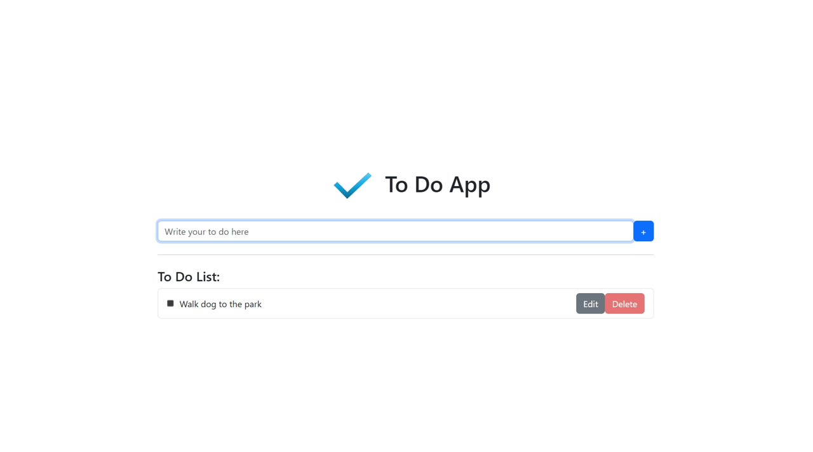

# To Do App: A Simple To Do Application To Manage Your To Do List using React + Vite + Express + SQLite3

# Installation of Dependencies
Simply run the command below in your project's root directory

    npm install

# Deployment
"npx vite" and "node server.js" must be run concurrently for this project.
"node server.js" initiates the server for the database (back-end) while "npx vite" initiates server for the the front-end.
To do so, I have added a script on package.json "start-dev" that runs "npx vite" and "node server.js" concurrently.

Use the following command in terminal:

    npm run start-dev

